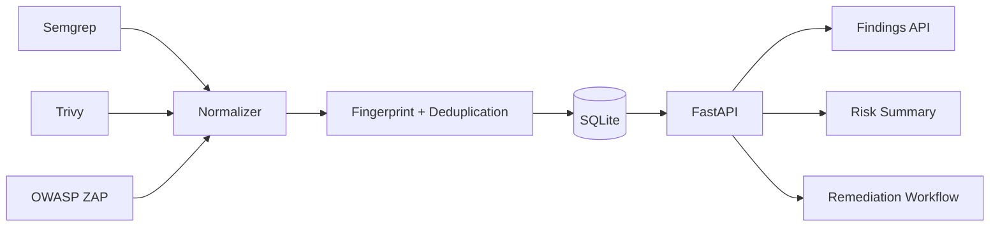

# AppSec Vulnerability Manager

A lightweight application security findings platform that normalizes results from multiple scanners into one remediation workflow.

## Why this project exists

Application security teams rarely work from one scanner. SAST, SCA, container, and DAST tools produce different schemas, severities, identifiers, and remediation metadata. This project demonstrates how those findings can be normalized, deduplicated, prioritized, assigned, and tracked against remediation SLAs.

## Features

- Import findings from **Semgrep**, **Trivy**, and **OWASP ZAP**
- Normalize scanner-specific fields into one vulnerability model
- Track **CVE**, **CWE**, **CVSS**, severity, source, file/location, owner, and status
- Deduplicate repeated findings using a deterministic fingerprint
- Prioritize findings with a transparent risk score
- Track remediation SLA state
- Filter findings by severity, status, or scanner
- Generate an aggregate security summary for dashboards or reporting
- SQLite persistence with no external database required

## Architecture



## Run locally

```bash
python -m venv .venv
source .venv/bin/activate
pip install -r requirements.txt
uvicorn app.main:app --reload
```

On Windows PowerShell:

```powershell
.venv\Scripts\Activate.ps1
pip install -r requirements.txt
uvicorn app.main:app --reload
```

Open the interactive API documentation at `http://127.0.0.1:8000/docs`.

## Example

Import a Semgrep report:

```bash
curl -X POST "http://127.0.0.1:8000/ingest/semgrep" \
  -H "Content-Type: application/json" \
  --data @sample-data/semgrep.json
```

View the normalized queue:

```bash
curl "http://127.0.0.1:8000/findings?severity=HIGH&status=OPEN"
```

View security posture:

```bash
curl http://127.0.0.1:8000/summary
```

## Risk prioritization

Risk is intentionally transparent rather than hidden behind a black box. The project combines scanner severity, CVSS when available, internet exposure, and exploitability flags. See [docs/RISK-MODEL.md](docs/RISK-MODEL.md).

## Defensive scope

The project processes scanner output and remediation metadata. It does not perform exploitation or scan third-party systems.
